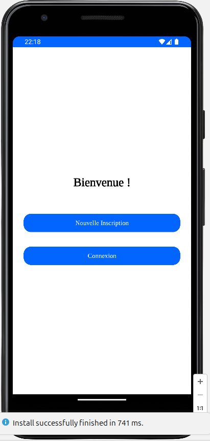
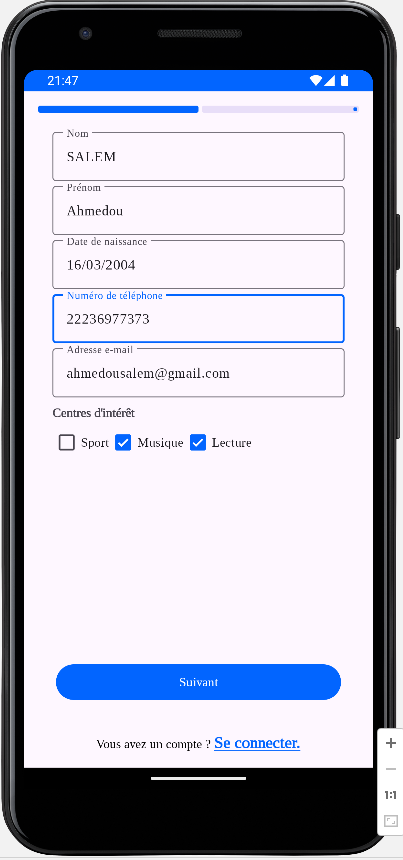
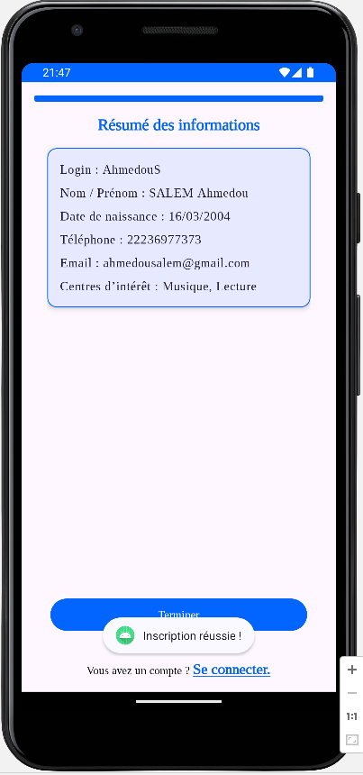
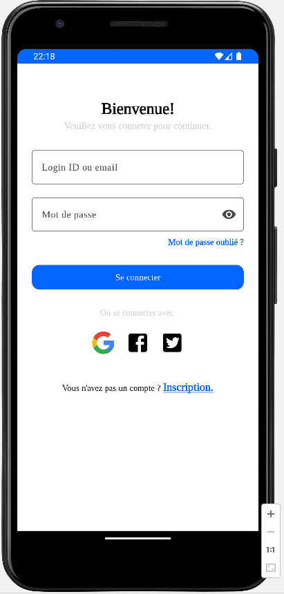
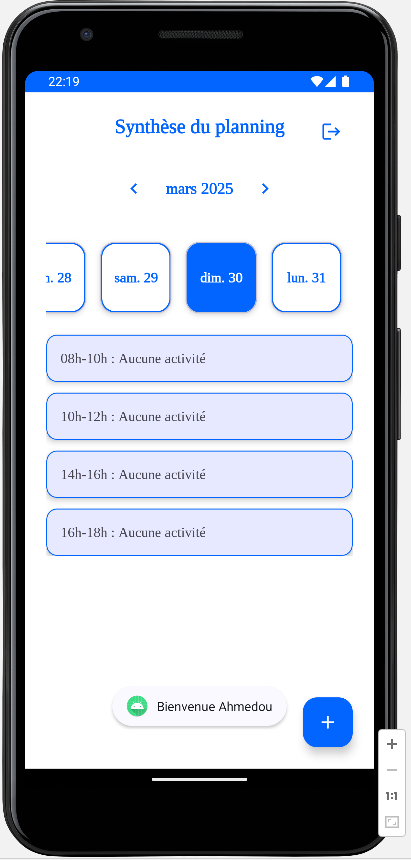

# 📱 TP3 - Application Android : Inscription, Connexion & Planning Journalier

Ce projet Android a été réalisé dans le cadre du TP3 de l'UE Programmation Mobile (HA811I) du Master 1 Génie Logiciel à l’Université de Montpellier.  
Il s'agit d'une application de gestion d'utilisateurs (inscription/connexion) avec planification journalière, en utilisant une base de données SQLite.  
👉 Deux versions ont été implémentées :
- **Version 1** : Architecture classique avec DAO SQLite manuelle.
- **Version 2** : Architecture moderne avec Jetpack, Room, ViewModel, Repository, exécution asynchrone (thread).

---

## 🛠️ Fonctionnalités

- **Nouvelle inscription** (formulaire en 3 étapes avec ViewPager2)
- **Connexion** avec login ou email
- **Validation des données** (âge, format login/email/téléphone, unicité en base)
- **Ajout de planning journalier** (4 créneaux) lié à une date
- **Synthèse des plannings** avec une vue mensuelle scrollable
- **Déconnexion** avec gestion de session locale

---

## 🎬 Aperçu de l'application

| Écran d'accueil | Étape 1 - Login | Étape 2 - Infos |
|-----------------|-----------------|------------------|
|  |  |  |

| Étape 3 - Récapitulatif | Connexion | Planning |
|-------------------------|-----------|----------|
|  |  |  |


---

## 🧰 Technologies

- **Langage** : Java
- **Base de données** : SQLite (Room pour la version Jetpack)
- **Jetpack** : ViewModel, Room, Lifecycle
- **Material Design** : UI moderne avec composants `MaterialButton`, `TextInputLayout`, `CardView`, etc.

---

## 📂 Structure du projet

📦 tp3-android-persistence/
┣ 📁 adapters/
┣ 📁 dao/
┣ 📁 database/
┣ 📁 fragments/
┣ 📁 models/
┣ 📁 utils/
┣ 📁 viewmodels/
┣ 📄 MainActivity.java
┣ 📄 SignUpActivity.java
┣ 📄 LoginActivity.java
┗ 📄 README.md

---

## 📌 Auteur
- **Ahmedou SALEM**
- **Master 1 Génie Logiciel — Université de Montpellier**

---

## 🌟 Remarques
Le projet respecte les bonnes pratiques Android (séparation logique, validation côté client, expérience utilisateur fluide).

---

## 🚀 Exécution du projet

1. Cloner le repo :
```bash
git clone https://github.com/ton-nom-utilisateur/tp3-android-planning.git

